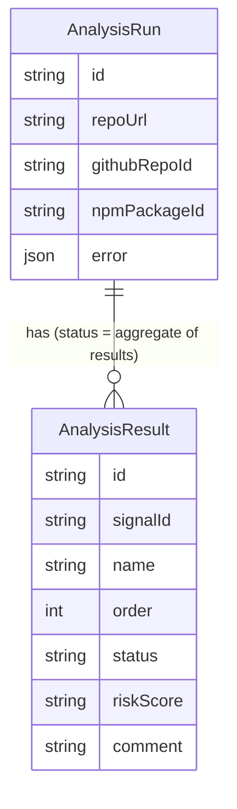
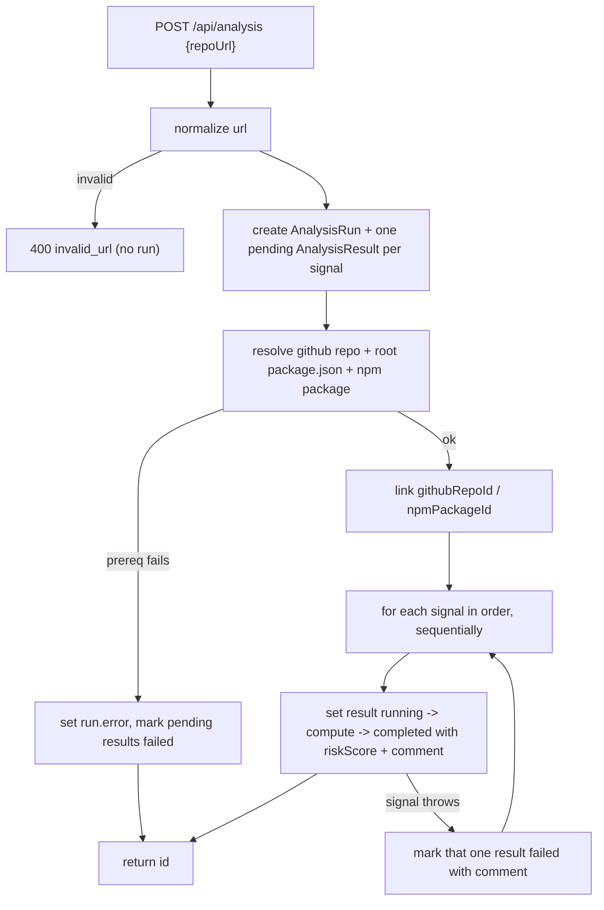

# Component Plan: Analysis Run (`/api/analysis`)

Orchestrates a trustworthiness analysis of a single target npm package (resolved from a GitHub repo) using the sources components. An `AnalysisRun` is an association object over per-signal `AnalysisResult` rows: the status lives on each result, and the run's status is the aggregate of its results. Synchronous, sequential, in-process — no queue, no scheduler. Part of the [high-level plan](project.md).

## Model Overview

- `AnalysisRun` — one submission of a repo URL. It is the association object: it owns a set of `AnalysisResult` rows and has no `status` column of its own. Its status is derived as the aggregate of its results.
- `AnalysisResult` — one signal/check for the run. Created in `pending` at the start, then an orchestration step fills in its `riskScore` + `comment` and flips its `status`.



## Data Model (Prisma)

```prisma
model AnalysisRun {
  id           String           @id @default(cuid())
  repoUrl      String
  githubRepoId String?          // linked after the github source resolves
  npmPackageId String?          // linked after the npm source resolves
  error        Json?            // { code, message } for a fatal, pre-signal failure
  results      AnalysisResult[]
  createdAt    DateTime         @default(now())
  updatedAt    DateTime         @updatedAt
}

model AnalysisResult {
  id            String      @id @default(cuid())
  analysisRunId String
  run           AnalysisRun @relation(fields: [analysisRunId], references: [id], onDelete: Cascade)
  signalId      String      // stable slug from the signal registry, e.g. "install_hooks"
  name          String      // display name, e.g. "Install hooks"
  order         Int         // stable display order (index in the registry)
  status        String      @default("pending") // ResultStatus union (see below)
  riskScore     String?     // RiskScore union ("red"|"yellow"|"green"); null until computed
  comment       String?     // human-readable explanation
  createdAt     DateTime    @default(now())
  updatedAt     DateTime    @updatedAt

  @@index([analysisRunId])
}
```

- No Prisma enums: `status` and `riskScore` are plain `String` columns. This keeps Postgres and TypeScript in sync with zero enum machinery — the allowed values live as string-literal unions + `const` arrays in code (below) and are validated before every write.
- Schema applied with `npm run db:push` (no migrations); dev and prod share one database.

## Risk Score + Status Constants

Declared in [app/api/analysis/client.ts](../app/api/analysis/client.ts) (the endpoint entrypoint, per AGENTS.md) and reused by orchestration and UI:

```ts
export const RISK_SCORES = ["red", "yellow", "green"] as const;
export type RiskScore = (typeof RISK_SCORES)[number];

export const RESULT_STATUSES = ["pending", "running", "completed", "failed"] as const;
export type ResultStatus = (typeof RESULT_STATUSES)[number];
```

`ResultStatus` is reused for both a result's `status` and the run's derived status.

## Aggregate Run Status

The run has no stored status; it is derived from its results:

- `pending` — every result is `pending`.
- `running` — at least one result has started but not all are terminal.
- `completed` — all results terminal and at least one `completed`.
- `failed` — all results terminal and all `failed` (or a fatal pre-signal `error` was recorded).

```ts
export function deriveRunStatus(results: { status: ResultStatus }[]): ResultStatus {
  if (results.length === 0) return "pending";
  if (results.every((r) => r.status === "pending")) return "pending";
  if (results.every((r) => r.status === "completed" || r.status === "failed")) {
    return results.every((r) => r.status === "failed") ? "failed" : "completed";
  }
  return "running";
}
```

Deriving avoids denormalization drift; the list endpoint only needs each run's results' `status` to compute it. Denormalize into a column later if the list query gets heavy.

## Signal Registry

The set of checks lives in a static registry in [lib/analysis/signals.ts](../lib/analysis/signals.ts). It is the single source of truth for which `AnalysisResult` rows get created (order = array index).

```ts
type SignalContext = {
  repo: GithubRepoData;        // from the github source
  packageJson: unknown;        // repo root package.json (target package identity)
  npmPackage: NpmPackageBlob;  // from the npm source
};

type SignalDef = {
  id: string;   // -> AnalysisResult.signalId
  name: string; // -> AnalysisResult.name
  compute: (ctx: SignalContext) => { riskScore: RiskScore; comment: string };
};

export const SIGNALS: SignalDef[] = [ /* one entry per signal from signals.md */ ];
```

MVP signal candidates (each becomes one `AnalysisResult`), computed purely from the cached github + npm blobs (see [signals.md](signals.md)):

- Package: npm package age, latest publish age, maintainers count, install hooks present, weekly/monthly downloads, deprecation flag, provenance/signature present.
- Repo: repo age, last-push recency, stars, archived/disabled flag, license present, repo <-> npm consistency (npm `repository` points back to the same GitHub repo).

## Endpoints (single `app/api/analysis/route.ts`)

Per AGENTS.md: `export const dynamic = "force-dynamic"`, `no-store` headers on every response, one top-level `try/catch` per handler, explicit request/response types, simple args via URL params.

- `POST /api/analysis` body `{ repoUrl }` (`CreateAnalysisRequest`) -> `{ ok, data: { id } }`. Normalizes the URL, creates the run + pending results, runs the pipeline synchronously and sequentially, returns the id.
- `GET /api/analysis?id=<id>` -> one run + its ordered results (`AnalysisRunResponse`) for the detail page to poll.
- `GET /api/analysis` (no id) -> list all runs with derived status (`AnalysisRunSummary[]`) for the browse page.

No PUT/DELETE for MVP.

## Execution (synchronous, sequential)

No task scheduling. The POST handler awaits the whole pipeline, then returns the id. The detail page still polls (identical code path to a future async version); on first load it will usually already show completed results. Switching to detached/background work later is a one-line change (don't `await` the orchestration call). The POST can take several seconds (multiple upstream calls) — acceptable for MVP.



Steps:

1. Validate/normalize `repoUrl`. Invalid -> `400 invalid_url`, no run created.
2. Create `AnalysisRun` + one `pending` `AnalysisResult` per `SIGNALS` entry (nested create / `createMany`).
3. Prerequisites (not signals): resolve the repo via the github source, read the root `package.json` name, resolve the npm package via the npm source. Assemble `SignalContext`.
   - On any prerequisite failure (`repo_not_found`, `no_package_json`, `package_not_found`, `upstream_error`): set `run.error`, mark all still-`pending` results `failed` with an explanatory `comment`, return the id.
   - On success, link `githubRepoId` / `npmPackageId`.
4. For each signal result in order: set `running`, run `compute(ctx)`, set `completed` with `riskScore` + `comment`. Per-signal failures are isolated — a small `safeRunSignal` helper (its single `try/catch`, in the orchestration lib, not the handler) records that one result as `failed` with the error message so one bad signal never aborts the rest.
5. Return `{ id }`.

## Client (`app/api/analysis/client.ts`)

Entrypoint with explicit types + browser functions (uses `browserApiClient`):

- Types: `RiskScore`, `ResultStatus`, `AnalysisResultData`, `AnalysisRunData`, `AnalysisRunSummary`, `CreateAnalysisRequest`, plus response envelopes.
- `createAnalysis(repoUrl: string): Promise<{ id: string }>`
- `getAnalysis(id: string): Promise<AnalysisRunData>`
- `listAnalyses(): Promise<AnalysisRunSummary[]>`

Server-side orchestration resolves sources via the github/npm source read-through functions described in [sources-github.md](sources-github.md) / [sources-npm.md](sources-npm.md).

## UI

- Home ([app/home-search.tsx](../app/home-search.tsx)): repurpose the submit to call `createAnalysis(repoUrl)` then `router.push('/ui/analysis/{id}')` (drop the inline github JSON display).
- `app/ui/analysis/[id]/page.tsx` (client): poll `getAnalysis(id)` (~1.5s) while the run's status is `pending`/`running`; render a run header (repoUrl, derived status) + a results table (name, status, risk badge colored red/yellow/green, comment). Plain/minimal for now — make it pretty later.
- `app/ui/analysis/page.tsx` (client): list runs (repoUrl, createdAt, derived status); each row links to `/ui/analysis/[id]`.

All `/ui/*` pages sit behind basic auth via [middleware.ts](../middleware.ts); the home page at `/` is public and posts through `browserApiClient` (bearer token attached automatically).

## Deferred: Overall Roll-Up

An overall run-level verdict/score (rolling the per-result `riskScore`s into one red/yellow/green or a 0-100 number) is deferred, along with per-signal weighting and thresholds. Per-signal results are captured regardless, so the roll-up is purely additive later.

## Errors

- `invalid_url` — bad repo URL; no run created (400).
- Prerequisite failures recorded on `run.error` and reflected by failing the pending results: `repo_not_found`, `no_package_json`, `package_not_found`, `upstream_error`.
- Per-signal failures recorded on the individual result (`status=failed`, `comment`); they never abort sibling signals.
- `internal_error` — unexpected handler failure (top-level `try/catch`).
