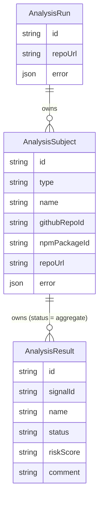
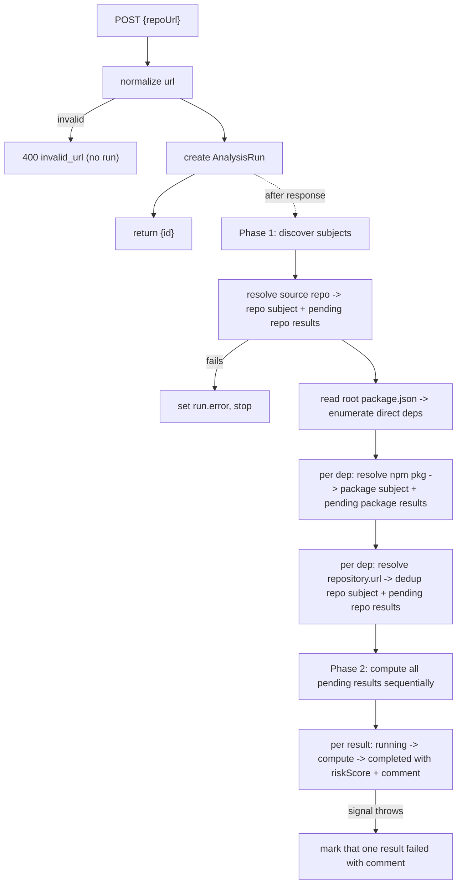

# Component Plan: Analysis Run (`/api/analysis`)

Orchestrates a trustworthiness analysis of a source GitHub repo and all its direct npm dependencies, using the sources components. An `AnalysisRun` owns a set of `AnalysisSubject`s (each one a repo or a package), and each subject owns per-signal `AnalysisResult` rows. The status lives on each result; a subject's status is the aggregate of its results, and the run's status is the aggregate of all results. Detached, sequential, in-process — no queue, no scheduler. Part of the [high-level plan](project.md).

## Scope

- Source repo -> repo signals. Plus package signals on the source's own package **if** the root `package.json` name resolves on npm (optional; fine if it doesn't).
- Each **direct** dependency (across `dependencies`, `devDependencies`, `peerDependencies`, `optionalDependencies`; version = `dist-tags.latest`) -> package signals, plus repo signals on its self-reported `repository.url` when resolvable (see [signals.md](signals.md)).
- Subjects are uniform: every subject is either a **repo** or a **package** — we do not distinguish "source" vs "dependency". Repo subjects are deduped by URL within a run, so a monorepo backing many packages is analyzed once.

## Model Overview

- `AnalysisRun` — one submission of a source repo URL. `repoUrl` is the analysis input/subject shown in the UI (not routing — that's `id`). Owns subjects; no status column (derived).
- `AnalysisSubject` — one repo or one package analyzed within the run. `type` is `repo` or `package`; `name` is the repo `owner/repo` (or url) or the package name. Holds the link to the cached source row and an optional per-subject `error`. Status is derived from its results.
- `AnalysisResult` — one signal for its subject. `pending` -> `running` -> `completed`/`failed`, carrying `riskScore` + `comment`. It inherits its data source (repo vs package) from its subject, so it stores no subject fields itself.



## Data Model (Prisma)

```prisma
model AnalysisRun {
  id        String            @id @default(cuid())
  repoUrl   String            // source repo input/subject (not used for routing)
  error     Json?             // { code, message } for a fatal, pre-subject failure (source repo unresolvable)
  subjects  AnalysisSubject[]
  createdAt DateTime          @default(now())
  updatedAt DateTime          @updatedAt
}

model AnalysisSubject {
  id            String           @id @default(cuid())
  analysisRunId String
  run           AnalysisRun      @relation(fields: [analysisRunId], references: [id], onDelete: Cascade)
  type          String           // SubjectType union ("repo"|"package")
  name          String           // repo "owner/repo" (or url) or package name
  githubRepoId  String?          // cached GithubRepo row id (repo subjects)
  npmPackageId  String?          // cached NpmPackage row id (package subjects)
  repoUrl       String?          // package subjects: self-reported repository.url (may be null/unresolvable)
  error         Json?            // per-subject fatal error (e.g. package_not_found)
  results       AnalysisResult[]
  createdAt     DateTime         @default(now())
  updatedAt     DateTime         @updatedAt

  @@unique([analysisRunId, type, name]) // dedup subjects within a run (e.g. a shared monorepo)
  @@index([analysisRunId])
}

model AnalysisResult {
  id                String          @id @default(cuid())
  analysisSubjectId String
  subject           AnalysisSubject @relation(fields: [analysisSubjectId], references: [id], onDelete: Cascade)
  signalId          String          // stable slug from the signal registry, e.g. "install_hooks"
  name              String          // display name, e.g. "Install hooks"
  status            String          @default("pending") // ResultStatus union
  riskScore         String?         // RiskScore union ("red"|"yellow"|"green"); null until computed
  comment           String?         // human-readable explanation
  createdAt         DateTime        @default(now())
  updatedAt         DateTime        @updatedAt

  @@index([analysisSubjectId])
}
```

- No Prisma enums: `type`, `status`, and `riskScore` are plain `String` columns validated in code against the constants below. Schema applied with `npm run db:push` (no migrations).
- `@@unique([analysisRunId, type, name])` enforces subject dedup; the worker also dedups in code before inserting.

## Risk Score + Status + Subject Constants

Declared in [app/api/analysis/client.ts](../app/api/analysis/client.ts) (the endpoint entrypoint, per AGENTS.md) and reused by orchestration and UI:

```ts
export const RISK_SCORES = ["red", "yellow", "green"] as const;
export type RiskScore = (typeof RISK_SCORES)[number];

export const RESULT_STATUSES = ["pending", "running", "completed", "failed"] as const;
export type ResultStatus = (typeof RESULT_STATUSES)[number];

export const SUBJECT_TYPES = ["repo", "package"] as const;
export type SubjectType = (typeof SUBJECT_TYPES)[number];
```

`ResultStatus` is reused for a result's `status`, a subject's derived status, and the run's derived status.

## Aggregate Status

Neither subjects nor runs store a status; both derive it from their results with one helper:

- `pending` — every result is `pending`.
- `running` — at least one result started but not all are terminal.
- `completed` — all results terminal and at least one `completed`.
- `failed` — all results terminal and all `failed` (or a fatal `error` was recorded on the subject/run).

```ts
export function deriveStatus(results: { status: ResultStatus }[]): ResultStatus {
  if (results.length === 0) return "pending";
  if (results.every((r) => r.status === "pending")) return "pending";
  if (results.every((r) => r.status === "completed" || r.status === "failed")) {
    return results.every((r) => r.status === "failed") ? "failed" : "completed";
  }
  return "running";
}
```

A subject's status = `deriveStatus(subject.results)`; the run's status = `deriveStatus(all results across subjects)`. Denormalize into columns later if list queries get heavy.

## Signal Registry

Two registries in [lib/analysis/signals.ts](../lib/analysis/signals.ts), keyed by data source. A `repo` subject creates one pending result per `REPO_SIGNALS` entry; a `package` subject one per `PACKAGE_SIGNALS` entry.

```ts
type RepoSignalContext = { repo: GithubRepoData };       // from the github source
type PackageSignalContext = { npmPackage: NpmPackageBlob }; // from the npm source

type SignalDef<Ctx> = {
  id: string;   // -> AnalysisResult.signalId
  name: string; // -> AnalysisResult.name
  compute: (ctx: Ctx) => { riskScore: RiskScore; comment: string };
};

export const REPO_SIGNALS: SignalDef<RepoSignalContext>[] = [ /* repo signals from signals.md */ ];
export const PACKAGE_SIGNALS: SignalDef<PackageSignalContext>[] = [ /* package signals from signals.md */ ];
```

MVP candidates (each becomes one `AnalysisResult`), computed purely from cached blobs:

- `REPO_SIGNALS`: repo age, last-push recency, stars, archived/disabled flag, license present.
- `PACKAGE_SIGNALS`: npm package age, latest publish age, maintainers count, install hooks present, weekly/monthly downloads, deprecation flag, provenance/signature present, resolvable-repo / repo <-> npm consistency.

### First signal to implement: `repo_last_push`

Start here: it is `repo`-only (no package code yet), needs no new fetching (`ctx.repo.pushed_at` is already in the github source cached blob, per [sources-github.md](sources-github.md)), and exercises all three risk levels.

- `id`: `repo_last_push`, `name`: `Last push recency`, in `REPO_SIGNALS`.
- Thresholds on age = `now - pushed_at`:
  - `green` — pushed within the last month.
  - `yellow` — 1-6 months.
  - `red` — older than 6 months (looks abandoned).
- `comment`: e.g. `Last push 3 months ago (2026-04-02)`.

```ts
{
  id: "repo_last_push",
  name: "Last push recency",
  compute: ({ repo }) => {
    const months =
      (Date.now() - new Date(repo.pushed_at).getTime()) / (1000 * 60 * 60 * 24 * 30);
    const riskScore: RiskScore = months <= 1 ? "green" : months <= 6 ? "yellow" : "red";
    return {
      riskScore,
      comment: `Last push ${Math.floor(months)} months ago (${repo.pushed_at.slice(0, 10)})`,
    };
  },
}
```

Thresholds are hardcoded for now (see [deferred.md](deferred.md) — making them web-configurable is deferred).

## Endpoints (single `app/api/analysis/route.ts`)

Per AGENTS.md: `export const dynamic = "force-dynamic"`, `no-store` headers on every response, one top-level `try/catch` per handler, explicit request/response types, simple args via URL params.

- `POST /api/analysis` body `{ repoUrl }` (`CreateAnalysisRequest`) -> `{ ok, data: { id } }`. Normalizes the URL, creates the run, schedules the orchestration to run after the response (detached, in-process), and returns the id immediately.
- `GET /api/analysis?id=<id>` -> the run with its subjects and their results (`AnalysisRunResponse`) for the detail page to poll.
- `GET /api/analysis` (no id) -> list all runs with derived status + subject counts (`AnalysisRunSummary[]`) for the browse page.

No PUT/DELETE for MVP.

## Execution (detached, sequential)

No task scheduling / queue. The POST handler creates the run, schedules the orchestration to run **after the response**, and returns the id immediately. The detail page then polls and shows subjects/results appearing and transitioning `pending -> running -> completed`.

Running work after the response is fine here because we run on a **persistent Railway Node process** (not serverless), so the process stays alive to finish. Either detach mechanism is acceptable: `after()` from `next/server` (preferred), or a fire-and-forget `void runAnalysis(id).catch(logError)` before returning. We avoid the two-step "client triggers start" approach (extra endpoint + double-start guards for no MVP benefit); a mid-run restart leaving results non-terminal is acceptable for MVP and can be handled later by an idempotent resume sweep.

Because subjects (dependencies) are only known after fetching the source repo's `package.json`, results cannot be created at POST time. The detached worker discovers subjects first, then computes.



Steps:

1. Validate/normalize `repoUrl`. Invalid -> `400 invalid_url`, no run created.
2. Create the `AnalysisRun`. Return `{ id }`; everything below runs detached, after the response.
3. **Phase 1 — discover subjects and create pending results:**
   - Resolve the source repo via the github source. On failure (`repo_not_found`/`upstream_error`) set `run.error` and stop. Otherwise create the source **repo** subject (link `githubRepoId`) + one pending result per `REPO_SIGNALS`.
   - Read the root `package.json`. If its `name` resolves on npm, add a source **package** subject (+ pending `PACKAGE_SIGNALS`). Missing `package.json` is not fatal — it just means no dependencies (run = source repo only).
   - Enumerate direct deps across the four groups (dedup by name). For each dep:
     - Resolve the npm package via the npm source; create a **package** subject (+ pending `PACKAGE_SIGNALS`), link `npmPackageId`, store `repoUrl` from the packument. On `package_not_found`/`upstream_error`, still create the subject but set `subject.error` and fail its pending results.
     - Normalize the packument `repository.url`. If resolvable and not already a repo subject in this run, resolve it via the github source and create a **repo** subject (+ pending `REPO_SIGNALS`), link `githubRepoId`. If missing/unresolvable, create no repo subject (the package's resolvable-repo signal flags it).
4. **Phase 2 — compute (sequential):** for every pending result (subjects in creation order, results in registry order): set `running`, run the subject-type-appropriate `compute` against the already-cached blob, set `completed` with `riskScore` + `comment`. Per-signal failures are isolated by a small `safeRunSignal` helper (its single `try/catch`, in the orchestration lib) that records that one result as `failed` with the error message, so one bad signal never aborts the rest.

Phases could interleave per subject, but keeping them separate gives a clean "everything pending, then progressively completing" polling experience. Source read-throughs warmed in Phase 1 are reused in Phase 2 (the fetched blobs are held in memory keyed by subject).

## Client (`app/api/analysis/client.ts`)

Entrypoint with explicit types + browser functions (uses `browserApiClient`):

- Types: `RiskScore`, `ResultStatus`, `SubjectType`, `AnalysisResultData`, `AnalysisSubjectData`, `AnalysisRunData`, `AnalysisRunSummary`, `CreateAnalysisRequest`, plus response envelopes.
- `createAnalysis(repoUrl: string): Promise<{ id: string }>`
- `getAnalysis(id: string): Promise<AnalysisRunData>`
- `listAnalyses(): Promise<AnalysisRunSummary[]>`

Server-side orchestration resolves sources via the github/npm source read-through functions described in [sources-github.md](sources-github.md) / [sources-npm.md](sources-npm.md).

## UI

- Home ([app/home-search.tsx](../app/home-search.tsx)): repurpose the submit to call `createAnalysis(repoUrl)` then `router.push('/ui/analysis/{id}')` (drop the inline github JSON display).
- `app/ui/analysis/[id]/page.tsx` (client): poll `getAnalysis(id)` (~1.5s) while the run's derived status is `pending`/`running`; render a run header (repoUrl, derived status) then one section per subject (type badge `repo`/`package`, `name`, subject-derived status) each containing a results table (signal name, status, risk badge red/yellow/green, comment). Package subjects can show their `repoUrl`. Plain/minimal for now — make it pretty later.
- `app/ui/analysis/page.tsx` (client): list runs (repoUrl, createdAt, derived status, subject count); each row links to `/ui/analysis/[id]`.

All `/ui/*` pages sit behind basic auth via [middleware.ts](../middleware.ts); the home page at `/` is public and posts through `browserApiClient` (bearer token attached automatically).

## Deferred: Overall Roll-Up

Per-subject and per-run verdict/score roll-ups (folding `riskScore`s into one red/yellow/green or a 0-100 number, with per-signal weighting and thresholds) are deferred. Individual results are captured regardless, so roll-ups are purely additive later.

## Errors

- `invalid_url` — bad repo URL; no run created (400).
- Fatal on `run.error`: source repo unresolvable (`repo_not_found`, `upstream_error`) — no subjects/results.
- Per-subject on `subject.error` (+ its results failed): `package_not_found`, `repo_not_found` (a dependency's repo), `upstream_error`. Other subjects continue.
- Per-signal on the individual result (`status=failed`, `comment`); never aborts sibling signals.
- `internal_error` — unexpected handler failure (top-level `try/catch`).
