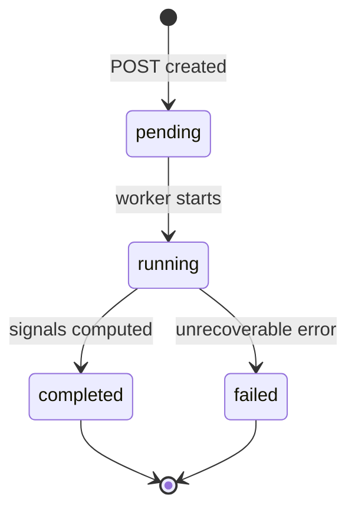

# Component Plan: Analysis (`/api/analysis`)

Orchestrates a trustworthiness analysis of a GitHub repo and its npm package using the sources components. Start-and-poll, in-process background work, no queue. Part of the [high-level plan](project.md).

## Responsibility

- Accept a GitHub repo URL, create an `Analysis` record, kick off background work, and return an id.
- In the background: resolve the repo (github source), link to its npm package via root `package.json`, resolve the package (npm source), compute signals, and store a result.
- Expose status + result for polling.

## Data Model (Prisma)

```prisma
enum AnalysisStatus {
  pending
  running
  completed
  failed
}

model Analysis {
  id            String         @id @default(cuid())
  repoUrl       String
  status        AnalysisStatus @default(pending)
  githubRepoId  String?
  npmPackageId  String?
  result        Json?          // versioned result blob (see Result Shape)
  error         Json?          // { code, message } on failure
  createdAt     DateTime       @default(now())
  updatedAt     DateTime       @updatedAt
}
```

## Endpoints

- `POST /api/analysis` body `{ repoUrl }` -> `{ ok, data: { id } }`. Validates/normalizes the URL, creates the record (status=pending), schedules background work, returns immediately.
- `GET /api/analysis/[id]` -> `{ ok, data: { id, status, result?, error? } }` for polling.

## Lifecycle



Background execution:

- After creating the record, schedule work (e.g. `queueMicrotask` / detached async fn) so the HTTP response returns first. The long-running Railway Node process keeps it alive.
- Set `status=running` when work begins; wrap in try/catch to set `failed` with an `error` blob on throw.
- Idempotency: `GET` is safe to poll repeatedly; a new `POST` always creates a new analysis (no dedup for MVP).

## Orchestration Steps

1. Parse `repoUrl` -> `{ owner, name }` (shared parser with the github source).
2. `githubSource.getRepo({ owner, name })` (read-through). On repo-not-found -> fail `repo_not_found`.
3. From the repo blob's root `package.json`: if missing (`packageJsonMissing`) -> fail `no_package_json`. Else read `name`.
4. `npmSource.getPackage(name)` (read-through). On not-found -> fail `package_not_found`.
5. Compute signals from the two blobs.
6. Persist `result` + link `githubRepoId` / `npmPackageId`, set `status=completed`.

## Signals (MVP candidates)

Computed purely from cached github + npm blobs. Each signal yields a normalized sub-result `{ id, label, value, assessment }`.

- Repo signals: repo age, last-push recency, stars/forks, open-issue ratio, archived/disabled flag, license present.
- Package signals: weekly downloads, maintainer count, deprecation flag, presence of install/postinstall scripts, dependency count, provenance/signature present, publish recency, repo<->npm consistency (npm `repository` points back to the same GitHub repo).

## Result Shape (`result`)

```jsonc
{
  "schemaVersion": 1,
  "repo": { "owner": "...", "name": "...", "url": "..." },
  "package": { "name": "...", "version": "..." },
  "signals": [
    { "id": "install_scripts", "label": "Install scripts", "value": true, "assessment": "warn" }
    // ...
  ],
  "summary": { /* DEFERRED: score and/or verdict roll-up */ }
}
```

## Deferred Decision: Output Roll-Up

The `summary` shape (numeric 0-100 score, categorical verdict like Trustworthy/Caution/Sketchy, or both) is intentionally deferred. Signals are captured individually regardless, so the roll-up can be added without reworking signal computation.

To resolve: pick score vs verdict vs both, weighting per signal, and thresholds.

## Errors

Error codes surfaced in `error`/response: `invalid_url`, `repo_not_found`, `no_package_json`, `package_not_found`, `upstream_error`, `internal_error`.
