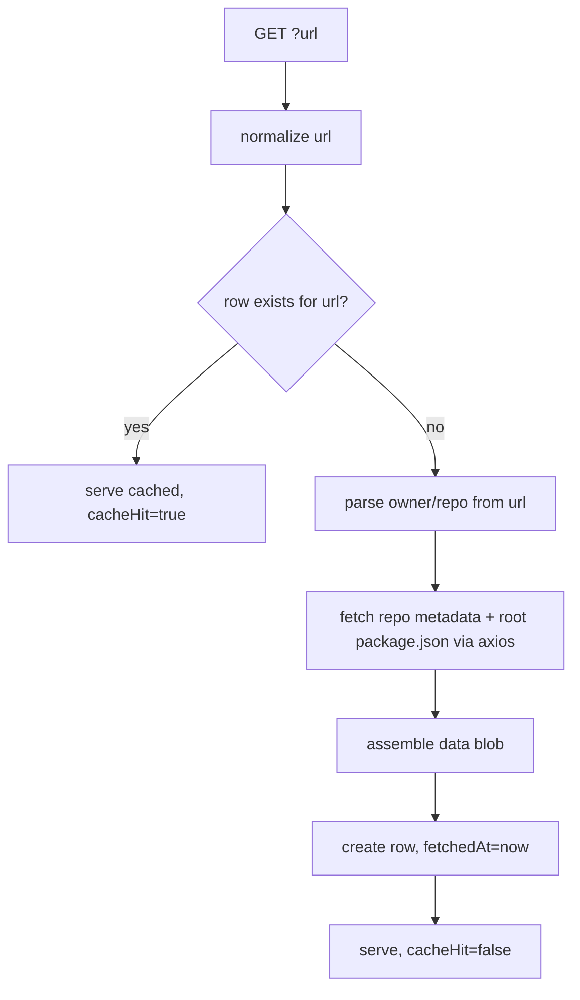

# Component Plan: GitHub Source (`/api/sources/github`)

Read-through cache for GitHub repo metadata, backed by Postgres and keyed by repo URL. Part of the [high-level plan](project.md).

## Responsibility

Given a GitHub repo URL, return the GitHub metadata (plus the repo's root `package.json`) needed by the analysis component, serving from cache when a row exists and refetching from the GitHub API otherwise. Also exposes cache-management endpoints and a small UI for inspecting/clearing the cache.

## Data Model (Prisma)

Keyed by `url` (unique). Owner/repo are still required to call the GitHub REST API (`GET /repos/{owner}/{repo}`), but they are parsed from the URL at fetch time rather than stored as columns.

```prisma
model GithubRepo {
  id        String   @id @default(cuid())
  url       String   @unique
  data      Json     // repo metadata + root package.json (see Cached Shape)
  fetchedAt DateTime
  createdAt DateTime @default(now())
  updatedAt DateTime @updatedAt
}
```

- Cache key: `url`, normalized (lowercase host, strip trailing `.git` and trailing slash) before lookup/write.
- Refresh policy: no TTL. An existing row is always a cache hit; to get a fresh analysis, delete the entry (via the UI/DELETE) then call GET again.
- Schema is applied with `npm run db:push` (no migrations); dev and prod share one database.

## Cached Shape (`data`)

Minimal fields we control, assembled from the GitHub API responses:

- `schemaVersion` (int) — a versioned jsonb blob so upstream shape changes don't require migrations.
- `repo`: fields from `GET /repos/{owner}/{repo}` — full_name, description, defaultBranch, stargazers_count, forks_count, subscribers_count, created_at, updated_at, pushed_at, license, archived, disabled, topics.
- `packageJson`: parsed root `package.json` object (or `null` if missing) + `packageJsonMissing` boolean.

## Endpoints (single `app/api/sources/github/route.ts`)

Following [AGENTS.md](../AGENTS.md): `export const dynamic = "force-dynamic"`, `no-store` headers on every response, one top-level `try/catch` per handler, explicit request/response types. Simple args go through URL params.

- `GET /api/sources/github?url=<repoUrl>` — read-through for one repo. Envelope: `{ ok, data, meta: { fetchedAt, cacheHit } }`.
- `GET /api/sources/github` (no `url`) — list all cached rows for the UI: `{ ok, data: GithubRepoSummary[] }`.
- `DELETE /api/sources/github?id=<id>` — evict one entry.
- `DELETE /api/sources/github?all=true` — clear all entries.

No POST/PUT needed for this resource: rows are only ever created as a side effect of the read-through GET.

## Read-Through Flow (no TTL)



## GitHub API Usage (axios)

- Use `axios` (per AGENTS.md) with `Authorization: Bearer ${GITHUB_TOKEN}` when the env var is present (60 req/hr unauth vs 5000/hr authed).
- Calls: `GET https://api.github.com/repos/{owner}/{repo}` for metadata; `GET https://api.github.com/repos/{owner}/{repo}/contents/package.json` (root), base64-decoded and JSON-parsed, for repo -> npm linkage.
- Errors:
  - 404 repo -> `{ ok: false, error: { message: "repo_not_found" } }`.
  - Missing root `package.json` -> still store the repo blob with `packageJsonMissing: true`; analysis decides how to fail.
  - Rate limit / 5xx -> surface `{ ok: false, error }` and do not store a row on upstream failure.

## Client (`app/api/sources/github/client.ts`)

Entrypoint for this endpoint with explicit input/output types. Our own code (analysis) uses it by calling the HTTP GET endpoint.

- Types: `GithubRepoData`, `GithubRepoResponse`, `GithubRepoSummary`, `ListGithubReposResponse`, `ErrorResponse`.
- `getGithubRepo(url: string): Promise<GithubRepoData>` — `axios.get` on `?url=` (the read-through call our code uses).
- `listGithubRepos(): Promise<GithubRepoSummary[]>`
- `deleteGithubRepo(id: string): Promise<void>`
- `clearGithubRepos(): Promise<void>`

## Management UI (`app/ui/sources/github/page.tsx`)

Mantine client page (mirrors [app/ui/test/page.tsx](../app/ui/test/page.tsx)): a table listing cached repos (url, fetchedAt), a per-row Remove button, and a Clear all button. Uses the client functions above.

## Open Questions

- Exact optional repo fields (contributors, commit activity, etc.) depend on the analysis signal list; finalize alongside [signals.md](signals.md).
