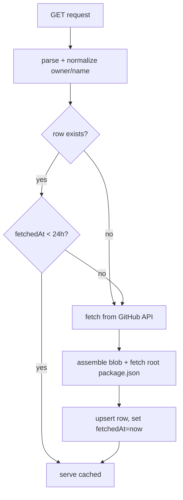

# Component Plan: GitHub Source (`/api/sources/github`)

Read-through cache for GitHub repo metadata, backed by Postgres. Part of the [high-level plan](project.md).

## Responsibility

Given a repo identity (owner/name), return GitHub metadata needed by the analysis component, serving from cache when fresh (< 24h) and refetching from the GitHub API otherwise. Also exposes the repo's root `package.json` used for repo -> npm linkage.

## Data Model (Prisma)

```prisma
model GithubRepo {
  id         String   @id @default(cuid())
  owner      String
  name       String
  data       Json     // raw metadata blob (see Cached Shape)
  fetchedAt  DateTime
  createdAt  DateTime @default(now())
  updatedAt  DateTime @updatedAt

  @@unique([owner, name])
}
```

- Cache key: `(owner, name)`, case-insensitive normalized to lowercase on write/read.
- `data` is a versioned jsonb blob so upstream shape changes don't require migrations.

## Cached Shape (`data`)

Minimal fields we control, assembled from the GitHub API responses:

- `schemaVersion` (int)
- `repo`: full_name, description, defaultBranch, stargazers_count, forks_count, subscribers_count, open_issues_count, license, archived, disabled, created_at, updated_at, pushed_at, topics.
- `packageJson`: parsed root `package.json` object (or `null` if missing) + `packageJsonMissing` boolean.
- Optional (fetched if cheap): contributors count, latest release/tag, commit activity summary. Exact set finalized with the analysis plan's signal needs.

## Endpoints

- `GET /api/sources/github?owner=<owner>&repo=<name>` (or `?url=<repoUrl>`): returns the cached-or-fetched blob. Response envelope: `{ ok, data, meta: { fetchedAt, cacheHit } }`.
- Input normalization: accept either owner/repo params or a full GitHub URL; a shared parser extracts `{owner, name}` and rejects non-GitHub / malformed URLs.

Cache-management actions (consumed by `/ui/sources/`), kept minimal:

- `GET /api/sources/github/list` - list cached repos with `fetchedAt` and staleness.
- `DELETE /api/sources/github?owner=&repo=` - evict a cache entry.

## Read-Through Flow



## GitHub API Usage

- Library: `octokit` (or plain `fetch`) with a token from env (`GITHUB_TOKEN`) for higher rate limits.
- Calls: `GET /repos/{owner}/{repo}` for metadata; `GET /repos/{owner}/{repo}/contents/package.json` (root) for linkage, base64-decoded and JSON-parsed.
- Errors:
  - 404 repo -> `{ ok: false, error: { code: "repo_not_found" } }`.
  - Missing root `package.json` -> still cache repo blob with `packageJsonMissing: true`; analysis decides how to fail.
  - Rate limit / 5xx -> surface `{ code: "upstream_error" }`; do not overwrite a good cached row on failure.

## Internal API (for analysis)

- `lib/sources/github/getRepo({ owner, name }): Promise<GithubRepoBlob>` - the read-through function analysis calls directly (in-process), bypassing HTTP.
- The HTTP route is a thin wrapper over this function.

## Open Questions

- Exact optional fields (contributors, commit activity) depend on the analysis signal list; finalize alongside `analysis.md`.
