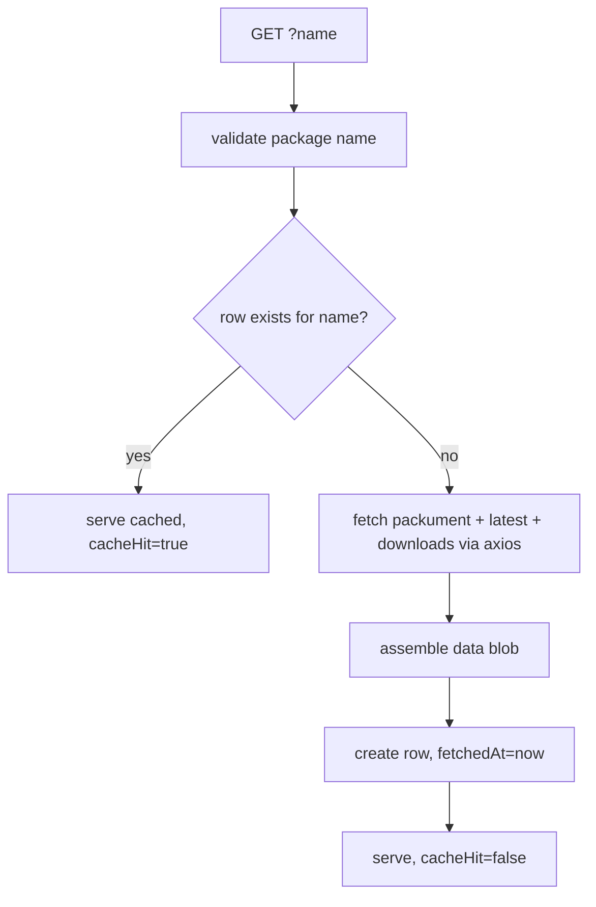

# Component Plan: npm Source (`/api/sources/npm`)

Read-through cache for npm package metadata, backed by Postgres and keyed by package name. Part of the [high-level plan](project.md).

## Responsibility

Given an npm package name, return the registry metadata needed by the analysis component, serving from cache when a row exists and refetching from the npm registry otherwise. Also exposes cache-management endpoints and a small UI for inspecting/clearing the cache.

## Data Model (Prisma)

```prisma
model NpmPackage {
  id         String   @id @default(cuid())
  name       String   @unique
  data       Json     // raw metadata blob (see Cached Shape)
  fetchedAt  DateTime
  createdAt  DateTime @default(now())
  updatedAt  DateTime @updatedAt
}
```

- Cache key: `name` (exact, including scope like `@scope/pkg`).
- Refresh policy: no TTL. An existing row is always a cache hit; to get a fresh analysis, delete the entry (via the UI/DELETE) then call GET again.
- Schema is applied with `npm run db:push` (no migrations); dev and prod share one database.

## Cached Shape (`data`)

- `schemaVersion` (int) — a versioned jsonb blob so upstream shape changes don't require migrations.
- `packument`: name, description, `dist-tags` (latest), maintainers, license, homepage, repository, time (created/modified + per-version publish times), deprecated flags.
- `latest`: the latest version's manifest subset - version, dependencies, devDependencies, `scripts` (esp. install/postinstall/preinstall), engines, dist (tarball, integrity, signatures/provenance if present), unpackedSize, fileCount.
- `downloads`: last-week/last-month counts from the npm downloads API.

## Endpoints (single `app/api/sources/npm/route.ts`)

Following [AGENTS.md](../AGENTS.md): `export const dynamic = "force-dynamic"`, `no-store` headers on every response, one top-level `try/catch` per handler, explicit request/response types. Simple args go through URL params.

- `GET /api/sources/npm?name=<package>` — read-through for one package. Envelope: `{ ok, data, meta: { fetchedAt, cacheHit } }`.
- `GET /api/sources/npm` (no `name`) — list all cached rows for the UI: `{ ok, data: NpmPackageSummary[] }`.
- `DELETE /api/sources/npm?id=<id>` — evict one entry.
- `DELETE /api/sources/npm?all=true` — clear all entries.

No POST/PUT needed for this resource: rows are only ever created as a side effect of the read-through GET.

## Read-Through Flow (no TTL)



## npm Registry Usage (axios)

- Use `axios` (per AGENTS.md) for all outbound calls; do not use `fetch`.
- Packument: `GET https://registry.npmjs.org/<name>` (public, no auth).
- Downloads: `GET https://api.npmjs.org/downloads/point/last-week/<name>` (and/or last-month).
- Name validation via `validate-npm-package-name` before fetching.
- Client-side pacing: wrap every outbound npm call in the shared [`RateLimiter`](../lib/rate-limiter.ts) (`acquire()` before each request), instantiated with `systemClock` and kept as a module-level singleton so all requests share one bucket.
  - `npm-registry` — covers `registry.npmjs.org` and `api.npmjs.org`. The npm registry is public/no-auth with no hard published rate limit, so `limitPerMinute` is a conservative tunable (not a documented cap like GitHub's), chosen to be polite and smooth bursts.
- Errors:
  - 404 -> `{ ok: false, error: { message: "package_not_found" } }`.
  - 5xx / network -> `{ ok: false, error }`; do not create or overwrite a row on upstream failure.
  - Downloads endpoint failure is non-fatal: cache the packument blob with `downloads: null`.

## Client (`app/api/sources/npm/client.ts`)

Entrypoint for this endpoint with explicit input/output types.

- Types: `NpmPackageData`, `NpmPackageResponse`, `NpmPackageSummary`, `ListNpmPackagesResponse`, `ErrorResponse`.
- `getNpmPackage(name: string): Promise<NpmPackageData>` — the read-through call our code uses.
- `listNpmPackages(): Promise<NpmPackageSummary[]>`
- `deleteNpmPackage(id: string): Promise<void>`
- `clearNpmPackages(): Promise<void>`
- Runtime split (per AGENTS.md): the management-UI functions run in the browser and use `browserApiClient` (relative URLs). The analysis-facing `getNpmPackage` runs server-side (see below) and must resolve through `serverApiClient` (`lib/api-client.server.ts`), since the browser client's relative `/api` URLs break in Node.

## Internal API (for analysis)

- Analysis consumes this source by calling the HTTP GET endpoint through `getNpmPackage(name)` (no in-process access).
- Because analysis is a server-side Route Handler, its `getNpmPackage` call must use `serverApiClient` (absolute `baseURL` from `APP_BASE_URL`), not `browserApiClient`.

## Management UI (`app/ui/sources/npm/page.tsx`)

Mantine client page (mirrors [app/ui/test/page.tsx](../app/ui/test/page.tsx)): a table listing cached packages (name, fetchedAt), a per-row Remove button, and a Clear all button. Uses the client functions above.

## Open Questions

- Whether to store full version history or just `latest` + `time`. Default to `latest` + `time` summary; expand if a signal needs per-version detail (finalize with [signals.md](signals.md)).
