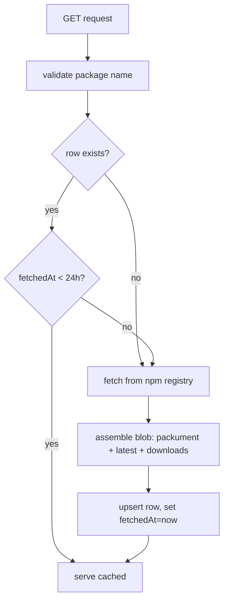

# Component Plan: npm Source (`/api/sources/npm`)

Read-through cache for npm package metadata, backed by Postgres. Part of the [high-level plan](project.md).

## Responsibility

Given an npm package name, return registry metadata needed by the analysis component, serving from cache when fresh (< 24h) and refetching from the npm registry otherwise.

## Data Model (Prisma)

```prisma
model NpmPackage {
  id         String   @id @default(cuid())
  name       String   @unique
  data       Json     // raw metadata blob (see Cached Shape)
  fetchedAt  DateTime
  createdAt  DateTime @default(now())
  updatedAt  DateTime @updatedAt
}
```

- Cache key: `name` (exact, including scope like `@scope/pkg`).
- `data` is a versioned jsonb blob.

## Cached Shape (`data`)

- `schemaVersion` (int)
- `packument`: name, description, `dist-tags` (latest), maintainers, license, homepage, repository, time (created/modified + per-version publish times), deprecated flags.
- `latest`: the latest version's manifest subset - version, dependencies, devDependencies, `scripts` (esp. install/postinstall/preinstall), engines, dist (tarball, integrity, signatures/provenance if present), unpackedSize, fileCount.
- `downloads`: last-week/last-month counts from the npm downloads API.

## Endpoints

- `GET /api/sources/npm?name=<package>`: returns the cached-or-fetched blob. Envelope: `{ ok, data, meta: { fetchedAt, cacheHit } }`.

Cache-management actions (consumed by `/ui/sources/`):

- `GET /api/sources/npm/list` - list cached packages with `fetchedAt` and staleness.
- `DELETE /api/sources/npm?name=` - evict a cache entry.

## Read-Through Flow



## npm Registry Usage

- Packument: `GET https://registry.npmjs.org/<name>` (public, no auth).
- Downloads: `GET https://api.npmjs.org/downloads/point/last-week/<name>` (and/or last-month).
- Name validation via `validate-npm-package-name` before fetching.
- Errors:
  - 404 -> `{ ok: false, error: { code: "package_not_found" } }`.
  - 5xx / network -> `{ code: "upstream_error" }`; do not overwrite a good cached row on failure.
  - Downloads endpoint failure is non-fatal: cache the packument blob with `downloads: null`.

## Internal API (for analysis)

- `lib/sources/npm/getPackage(name: string): Promise<NpmPackageBlob>` - the read-through function analysis calls directly (in-process).
- The HTTP route is a thin wrapper over this function.

## Open Questions

- Whether to store full version history or just `latest` + `time`. Default to `latest` + `time` summary; expand if a signal needs per-version detail (finalize with `analysis.md`).
