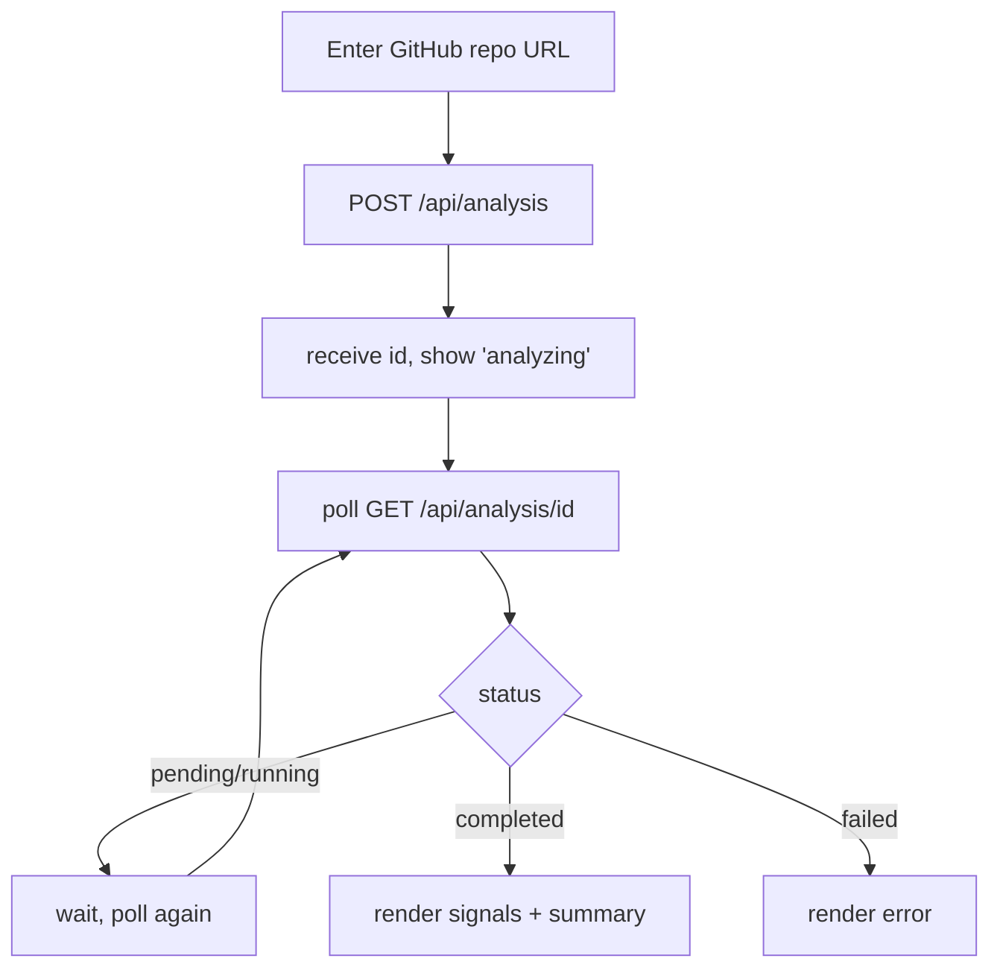

# Component Plan: Web UI (`/ui`)

Next.js App Router pages that let a user submit a GitHub repo, trigger analysis, poll for status, and view results. Also hosts simple cache-management pages. Part of the [high-level plan](project.md).

## Pages

- `app/ui/page.tsx` - main flow: input, submit, live status, results.
- `app/ui/sources/page.tsx` - cache-management landing (links to github + npm cache views).
- `app/ui/sources/github/page.tsx` - list cached GitHub repos; show `fetchedAt`/staleness; evict.
- `app/ui/sources/npm/page.tsx` - list cached npm packages; show `fetchedAt`/staleness; evict.

## Main Flow

- Submit: client-side validate the URL looks like a GitHub repo, then `POST /api/analysis`.
- Polling: after receiving `{ id }`, poll `GET /api/analysis/[id]` on an interval (e.g. every 1.5-2s) with a max timeout/backoff; stop on `completed` or `failed`.
- Implemented as a client component managing `{ status, result, error }`; polling via `setInterval`/`setTimeout` cleared on unmount and on terminal status.

## Results View

- Repo + package header (name, version, links to GitHub/npm).
- Per-signal list: label, value, and assessment (e.g. ok/warn/bad styling) from the analysis `result.signals`.
- `summary` block rendered when present (score/verdict roll-up is deferred in `analysis.md`); until defined, show signals only with a neutral heading.
- Error state renders the analysis `error.code`/message with a retry action.

## Cache-Management Pages (`/ui/sources/`)

- GitHub: table from `GET /api/sources/github/list`; each row shows owner/name, `fetchedAt`, stale (>24h) badge, and a delete action (`DELETE /api/sources/github?owner=&repo=`).
- npm: table from `GET /api/sources/npm/list`; each row shows name, `fetchedAt`, stale badge, and a delete action (`DELETE /api/sources/npm?name=`).
- Purpose is inspection + manual eviction; no forced-refresh param (deleting then re-analyzing refetches).

## Conventions

- Consume the shared `{ ok, data, error, meta }` API envelope.
- Keep styling clean and modern; results readability is the priority.
- No auth for MVP.
